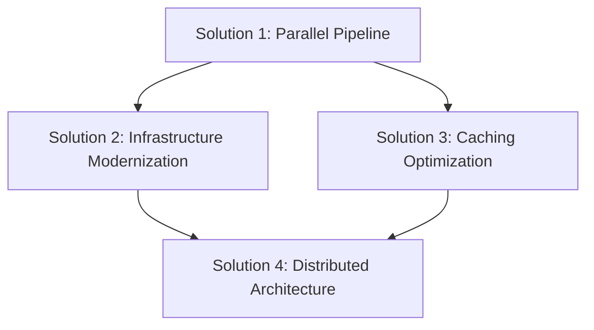

# Program Proposal: Faster CICD Pipelines

*Updated: 2024-03-26 23:15*

## Initial Prompt

### Program Name
Faster CICD Pipelines

### Elevator Pitch
We need to optimize our build, lint, testing, and deployment scripts to boost developer productivity and ship critical fixes faster. Right now, PR pipelines take 15-25 minutes, deployments up to 15 minutes, and local development tasks are sluggish—delaying hotfixes that could be stopping financial loss or data corruption. It's 2025—we can and should do better.

## Rest of Template

### Primary Motivation
- [X] Operational Efficiency: Save time or reduce costs by improving tools/processes

## Impact Assessment

### Internal Impact

#### Primary Edge Beneficiary Group
- [X] Engineering Team

#### Edge Employee Impact

**Number of Employees Affected:**
- [ ] 1-5 employees
- [ ] 6-20 employees
- [X] 21-50 employees
- [ ] 51-100 employees
- [ ] 101-200 employees
- [ ] 201-500 employees
- [ ] 500+ employees

**Average Impact Level:**
- [ ] Minimal: Minor workflow improvements
- [ ] Low: Noticeable but small efficiency gains
- [ ] Medium: Significant workflow improvements
- [X] High: Major productivity/satisfaction boost
- [ ] Critical: Transformative impact on daily work

### External Impact

#### Primary External Beneficiary Group
- [X] All Customers

#### External Impact Metrics

**Percentage of Group Affected:**
- [ ] 1-10%
- [ ] 11-25%
- [ ] 26-50%
- [ ] 51-75%
- [ ] 76-90%
- [X] 91-100%

**Average Impact Level:**
- [ ] Minimal: Slight improvement in experience
- [X] Low: Noticeable but small benefit
- [ ] Medium: Clear and valuable improvement
- [ ] High: Significant value addition
- [ ] Critical: Essential improvement

## Problem Statement

### Current Problem
Our current CICD pipeline performance is creating significant bottlenecks in our development workflow and impacting our ability to respond quickly to critical issues. The key pain points include:

- PR pipelines taking 15-25 minutes, slowing down code review cycles and feature delivery
- Deployment processes requiring up to 15 minutes, delaying critical hotfixes
- Sluggish local development tasks reducing developer productivity
- Extended pipeline times increasing the risk window for critical issues like financial loss or data corruption
- Developer time being wasted waiting for builds and tests to complete

This situation is particularly problematic when we need to deploy urgent fixes for issues that could be causing financial loss or data corruption. In 2025, with modern tooling and infrastructure available, these pipeline times are unacceptable and represent a clear opportunity for optimization.

## Objectives and Success Metrics

### External Beneficiary Objectives
- [X] Faster delivery of critical fixes and features to customers (with minimal user-facing impact)
- [X] Reduced system vulnerability windows during deployments (backend improvement)
- [ ] More frequent and reliable feature releases

### Internal Beneficiary Objectives
- [X] Reduce PR pipeline execution time by at least 50%
- [X] Cut deployment time to under 5 minutes
- [X] Improve local development task performance by 40%

### Key Results (Success Metrics)
1. Reduce PR pipeline execution time from 15-25 minutes to 5-8 minutes by Q2 2025
   - Milestone 1: Achieve 10-15 minute runs by Q1 2025
   - Milestone 2: Reach final target by end of Q2 2025
   - Priority: HIGH - Critical for developer productivity

2. Decrease deployment time from 15 minutes to under 5 minutes by Q2 2025
   - Milestone 1: Achieve 8-minute deployments by Q1 2025
   - Milestone 2: Reach final target by end of Q2 2025
   - Priority: HIGH - Critical for incident response

3. Improve local development task completion time by 40% by Q3 2025
   - Milestone 1: 20% improvement by Q2 2025
   - Milestone 2: Full improvement by end of Q3 2025
   - Priority: MEDIUM - Important but less critical than pipeline speeds

4. Achieve 99.9% pipeline reliability rate by Q3 2025
   - Milestone 1: 99.5% by Q2 2025
   - Milestone 2: 99.9% by end of Q3 2025
   - Priority: HIGH - Essential for maintaining productivity gains

## Solution Planning

### Implementation Strategy

#### Phase 1: Quick Wins (Q1 2025)
- Implement Solution 1 (Parallel Pipeline Execution)
- Begin Solution 3 (Caching and Dependency Optimization)
- Rationale: These solutions offer immediate gains with medium effort

#### Phase 2: Infrastructure Evolution (Q2 2025)
- Implement Solution 2 (Pipeline Infrastructure Modernization)
- Complete Solution 3 optimizations
- Rationale: Build on initial improvements with more substantial changes

#### Phase 3: Scale and Distribute (Q3 2025)
- Implement Solution 4 (Distributed Pipeline Architecture)
- Rationale: Leverage modernized infrastructure to implement distributed approach

#### Solution Dependencies

### Possible Solutions

#### Solution 1: Parallel Pipeline Execution
- Description: Restructure pipelines to maximize parallel execution of independent tasks
- Pros: 
  - No infrastructure changes required
  - Relatively quick to implement
  - Low risk approach
- Cons: 
  - May hit limitations with current infrastructure
  - Benefits might plateau
- Estimated Effort: Medium

#### Solution 2: Pipeline Infrastructure Modernization
- Description: Upgrade CI/CD infrastructure with modern hardware and tools
- Pros:
  - Maximum performance improvement potential
  - Future-proof solution
  - Additional benefits beyond speed
- Cons:
  - Higher initial cost
  - More complex implementation
  - Potential learning curve
- Estimated Effort: High

#### Solution 3: Caching and Dependency Optimization
- Description: Implement intelligent caching strategies and optimize dependency management across all pipeline stages
- Pros:
  - Immediate performance gains
  - Reduced resource usage
  - Cost-effective solution
  - Can be combined with other solutions
- Cons:
  - Requires careful cache invalidation strategy
  - May need significant initial analysis
  - Could introduce complexity in dependency management
- Estimated Effort: Medium

#### Solution 4: Distributed Pipeline Architecture
- Description: Implement a distributed pipeline architecture with regional build agents and smart workload distribution
- Pros:
  - Highly scalable solution
  - Better resource utilization
  - Reduced network latency
  - Can handle multiple concurrent builds efficiently
- Cons:
  - Complex orchestration required
  - Higher operational complexity
  - Requires careful monitoring and load balancing
  - May increase cloud costs
- Estimated Effort: High

## Risk Assessment

### Assumptions and Validations

#### Market Viability
- Assumption: Faster pipelines will significantly impact developer productivity
- Validation: Track developer wait times and productivity metrics before and after changes
- Confidence: High

#### User Desirability
- Assumption: Development teams will adapt to new pipeline structures
- Validation: Run pilot program with one development team
- Confidence: High

#### Technical Feasibility
- Assumption: We can achieve 50%+ reduction in pipeline times
- Validation: Proof of concept with subset of tests and builds
- Confidence: Medium

#### Operational Impact
- Build Cost: Medium - Primarily engineering time with possible infrastructure costs
- Maintenance Cost: Low - Automated pipelines with monitoring
- Resource Requirements:
  - DevOps engineer time for implementation
  - Development team input for optimization
  - Possible additional CI/CD infrastructure
  - Monitoring and alerting tools

## Progress History

### 2024-03-26 23:15 - Impact Assessment Revision
- 🤔 Decisions: 
  - Adjusted external impact level from "High" to "Low" to better reflect day-to-day user experience
  - Updated external beneficiary objectives to align with lower impact assessment
  - Removed checkmark from "More frequent releases" objective as it's less relevant with low impact
- ❌ Issues: None at this stage
- 📚 Documentation: Updated impact assessment and objectives sections
- ⏭️ Next: Validate implementation strategy with technical leads 

### 2024-03-26 23:00 - Document Clarification
- 🤔 Decisions: 
  - Adjusted external impact level to "High" to align with problem severity
  - Standardized objective formats with checkboxes
  - Added implementation phases and dependencies
  - Added detailed milestones to success metrics
- ❌ Issues: None at this stage
- 📚 Documentation: Updated impact assessment, objectives, and solution planning sections
- ⏭️ Next: Validate implementation strategy with technical leads 